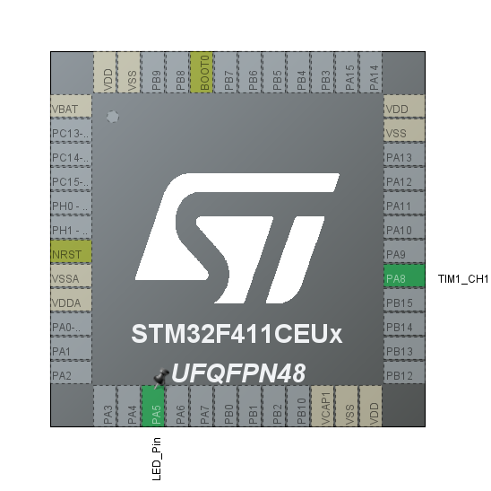
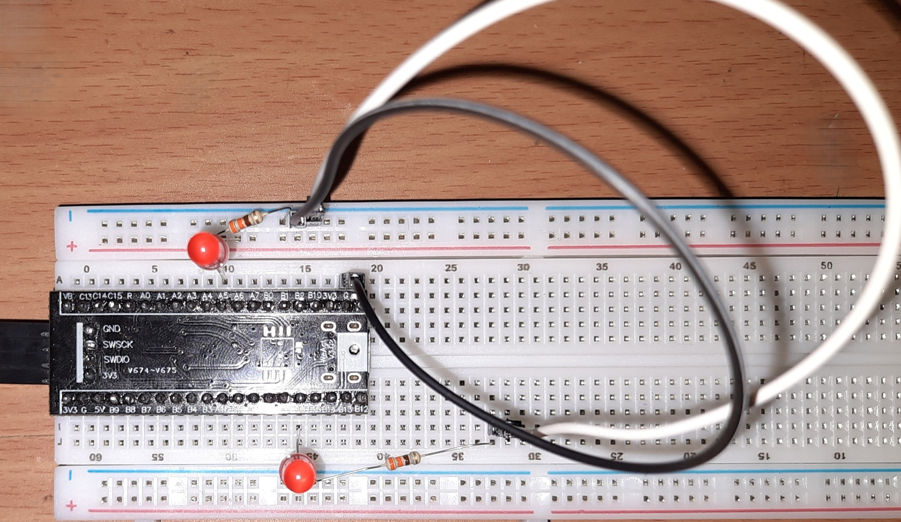

# STM32F411CEU6 LED Blink & PWM Fade Demo

This project demonstrates basic GPIO control and PWM (Pulse Width Modulation) on an STM32F411CEU6 microcontroller using STM32CubeIDE.

- **One LED** blinks using GPIO.
- **Another LED** fades smoothly using PWM.

## 💡 Features

- GPIO pin toggle for LED blinking.
- PWM signal using TIM1 for LED fading.
- Implemented using STM32 HAL in STM32CubeIDE.

## 🛠️ Hardware

- STM32F411CEU6 ("Black Pill" board or similar).
- Two LEDs (PA5 for blinking, PA8 for fading).
- Two resistors to protect LEDs.
- Jumper wires and breadboard for connections.

## ⚡ Usage

1. Clone or download this repo.
2. Open it in STM32CubeIDE.
3. Create the circuit.
4. Connect your STM32 board and flash.
5. One LED blinks, another LED fades.

## 🗺️ CubeMX Configuration

Below is a screenshot of the `.ioc` configuration used for this project.

## 🔌 Circuit Photo

Below is a photo of the actual breadboard circuit used for this project.

## 🎥 Demo Video

Check out the project in action on [LinkedIn](https://www.linkedin.com/posts/kisoththamanm_stm32-embeddedsystems-pwm-activity-7334945579623399424-wEJQ?utm_source=share&utm_medium=member_android&rcm=ACoAAEzVOzIBiqu6-2ZftSgw27DVIqZvn8j2sg0).

---
